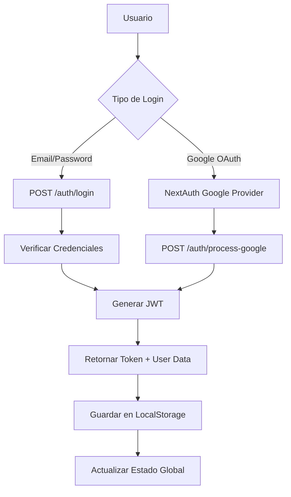

# 🚗 ByCarket - Plataforma de Venta de Vehículos Potenciada por IA

## 📋 Índice

1. [Descripción General](#descripción-general)
2. [Arquitectura del Proyecto](#arquitectura-del-proyecto)
3. [Stack Tecnológico](#stack-tecnológico)
4. [Características Principales](#características-principales)
5. [Seguridad](#seguridad)
6. [API y Rutas](#api-y-rutas)
7. [Sistema de Autenticación](#sistema-de-autenticación)
8. [Gestión de Estados](#gestión-de-estados)
9. [Base de Datos](#base-de-datos)
10. [Servicios Externos](#servicios-externos)
11. [Instalación y Configuración](#instalación-y-configuración)
12. [Scripts Disponibles](#scripts-disponibles)
13. [Estructura de Carpetas](#estructura-de-carpetas)
14. [Funcionalidades Implementadas](#funcionalidades-implementadas)
15. [Funcionalidades Futuras](#funcionalidades-futuras)
16. [Optimizaciones](#optimizaciones)
17. [Contribución](#contribución)

---

## 🎯 Descripción General

**ByCarket** es una plataforma web intermediaria que facilita la búsqueda, compra y venta de vehículos, potenciada por inteligencia artificial. La aplicación conecta vendedores y compradores en un marketplace seguro y eficiente, con funcionalidades avanzadas de búsqueda, chat inteligente, y gestión de publicaciones.

### Características Destacadas

- 🤖 **Chat asistente con IA** para recomendaciones personalizadas
- 🔍 **Búsqueda avanzada** con filtros múltiples
- 📱 **Diseño responsive** optimizado para todos los dispositivos
- 💳 **Sistema de suscripciones** con integración de Stripe
- 🔐 **Autenticación robusta** con múltiples proveedores
- 📧 **Notificaciones por email** automáticas
- 🖼️ **Gestión de imágenes** con Cloudinary
- 📊 **Panel administrativo** completo

---

## 🏗 Arquitectura del Proyecto

La aplicación sigue una arquitectura **monorepo** con separación clara entre frontend y backend:

```
ByCarket-PF/
├── bycarket--back/     # API Backend (NestJS)
├── bycarket--front/    # Frontend Web (Next.js)
└── README.md
```

### Patrón de Arquitectura

- **Backend**: Arquitectura modular con NestJS
- **Frontend**: Server-Side Rendering con Next.js
- **Base de Datos**: PostgreSQL con TypeORM
- **Comunicación**: RESTful API con documentación Swagger

---

## 💻 Stack Tecnológico

### Backend (NestJS)

| Tecnología     | Versión  | Propósito                       |
| -------------- | -------- | ------------------------------- |
| **NestJS**     | ^11.0.1  | Framework principal del backend |
| **TypeORM**    | ^0.3.24  | ORM para base de datos          |
| **PostgreSQL** | ^8.14.1  | Base de datos principal         |
| **JWT**        | ^11.0.0  | Autenticación y autorización    |
| **Passport**   | ^0.7.0   | Estrategias de autenticación    |
| **Cloudinary** | ^2.6.0   | Gestión de imágenes             |
| **Stripe**     | ^18.1.1  | Procesamiento de pagos          |
| **OpenAI**     | ^4.100.0 | Integración con IA              |
| **Nodemailer** | ^7.0.3   | Envío de emails                 |
| **Bcrypt**     | ^5.1.1   | Encriptación de contraseñas     |
| **Swagger**    | ^11.2.0  | Documentación de API            |

### Frontend (Next.js)

| Tecnología        | Versión  | Propósito                        |
| ----------------- | -------- | -------------------------------- |
| **Next.js**       | ^15.3.1  | Framework principal del frontend |
| **React**         | ^19.0.0  | Librería de interfaz             |
| **TypeScript**    | ^5       | Tipado estático                  |
| **TailwindCSS**   | ^4       | Framework de estilos             |
| **NextAuth.js**   | ^4.24.11 | Autenticación del cliente        |
| **React Query**   | ^5.85.9  | Gestión de estado del servidor   |
| **Zustand**       | ^5.0.4   | Gestión de estado global         |
| **Formik**        | ^2.4.6   | Manejo de formularios            |
| **Axios**         | ^1.9.0   | Cliente HTTP                     |
| **Framer Motion** | ^12.12.1 | Animaciones                      |
| **React Icons**   | ^5.5.0   | Iconografía                      |

---

## ✨ Características Principales

### 🏪 Marketplace de Vehículos

- **Búsqueda Avanzada**: Filtros por marca, modelo, año, precio, kilometraje, condición
- **Listado Paginado**: Navegación eficiente con resultados optimizados
- **Vista Detallada**: Información completa del vehículo con galería de imágenes
- **Productos Relacionados**: Sugerencias del mismo vendedor

### 👤 Sistema de Usuarios

- **Registro y Login**: Email/contraseña y OAuth con Google
- **Perfiles**: Gestión completa de información personal
- **Roles**: Usuario básico, Premium y Administrador
- **Dashboard**: Panel personalizado según el rol del usuario

### 🚗 Gestión de Vehículos

- **Registro de Vehículos**: Formulario completo con validaciones
- **Subida de Imágenes**: Múltiples fotos con compresión automática
- **Edición**: Actualización de información y fotos
- **Eliminación**: Soft delete con confirmación

### 📢 Sistema de Publicaciones

- **Crear Publicaciones**: Vincular vehículos a publicaciones
- **Estados**: Activa, Pendiente, Vendida, Inactiva
- **Límites por Rol**: 3 publicaciones para usuarios básicos, ilimitadas para Premium
- **Moderación**: Herramientas administrativas para gestión

### 🤖 Asistente IA

- **Chat Inteligente**: Recomendaciones basadas en preferencias
- **Análisis de Vehículos**: Información detallada generada por IA
- **Búsqueda Conversacional**: Encontrar vehículos mediante lenguaje natural

### 💰 Sistema de Suscripciones

- **Planes**: Básico (gratis), Premium (mensual/trimestral/anual)
- **Pagos**: Integración completa con Stripe
- **Webhooks**: Actualización automática de estado de suscripción
- **Facturación**: Generación automática de facturas

---

## 🔐 Seguridad

### Autenticación y Autorización

```typescript
// Guards implementados
- AuthGuard: Verificación de JWT
- DualAuthGuard: Support JWT local y Auth0
- RolesGuard: Control de acceso por roles
```

### Medidas de Seguridad

- **JWT Tokens**: Expiración configurable (1 día por defecto)
- **Encriptación**: Bcrypt para contraseñas con salt rounds
- **Validación**: Class-validator para DTOs
- **CORS**: Configuración restrictiva por dominio
- **Rate Limiting**: Protección contra spam
- **Sanitización**: Prevención de inyección de código

### Variables de Entorno

```bash
# Base de datos
DB_HOST=localhost
DB_PORT=5432
DB_USERNAME=postgres
DB_PASSWORD=password
DB_NAME=bycarket

# JWT
JWT_SECRET=your_jwt_secret

# Cloudinary
CLOUDINARY_CLOUD_NAME=your_cloud_name
CLOUDINARY_API_KEY=your_api_key
CLOUDINARY_API_SECRET=your_api_secret

# Stripe
STRIPE_SECRET_KEY=sk_test_...
STRIPE_WEBHOOK_SECRET=whsec_...

# OpenAI
OPENAI_API_KEY=sk-...

# Email
MAIL_HOST=smtp.gmail.com
MAIL_USER=your_email@gmail.com
MAIL_PASS=your_app_password
```

---

## 🛣️ API y Rutas

### Rutas de Autenticación

| Método | Endpoint                | Descripción                | Autenticación |
| ------ | ----------------------- | -------------------------- | ------------- |
| POST   | `/auth/register`        | Registro de usuario        | ❌            |
| POST   | `/auth/login`           | Inicio de sesión           | ❌            |
| POST   | `/auth/process-google`  | Procesamiento OAuth Google | ❌            |
| POST   | `/auth/create-admin`    | Crear administrador        | ❌            |
| PATCH  | `/auth/change-email`    | Cambiar email              | ✅            |
| PATCH  | `/auth/change-password` | Cambiar contraseña         | ✅            |
| GET    | `/auth/activate/:token` | Activar cuenta             | ❌            |

### Rutas de Usuarios

| Método | Endpoint         | Descripción              | Autenticación |
| ------ | ---------------- | ------------------------ | ------------- |
| GET    | `/users/me`      | Datos del usuario actual | ✅            |
| PATCH  | `/users/me`      | Actualizar perfil        | ✅            |
| DELETE | `/users/me`      | Eliminar cuenta          | ✅            |
| GET    | `/users`         | Listar usuarios (Admin)  | ✅            |
| PATCH  | `/users/:id/ban` | Banear usuario (Admin)   | ✅            |

### Rutas de Vehículos

| Método | Endpoint        | Descripción               | Autenticación |
| ------ | --------------- | ------------------------- | ------------- |
| GET    | `/vehicles`     | Listar vehículos públicos | ❌            |
| GET    | `/vehicles/me`  | Vehículos del usuario     | ✅            |
| POST   | `/vehicles`     | Crear vehículo            | ✅            |
| GET    | `/vehicles/:id` | Detalle de vehículo       | ❌            |
| PATCH  | `/vehicles/:id` | Actualizar vehículo       | ✅            |
| DELETE | `/vehicles/:id` | Eliminar vehículo         | ✅            |

### Rutas de Publicaciones

| Método | Endpoint     | Descripción               | Autenticación |
| ------ | ------------ | ------------------------- | ------------- |
| GET    | `/posts`     | Listar publicaciones      | ❌            |
| GET    | `/posts/me`  | Publicaciones del usuario | ✅            |
| POST   | `/posts`     | Crear publicación         | ✅            |
| GET    | `/posts/:id` | Detalle de publicación    | ❌            |
| PATCH  | `/posts/:id` | Actualizar publicación    | ✅            |
| DELETE | `/posts/:id` | Eliminar publicación      | ✅            |

### Rutas de Datos de Referencia

| Método | Endpoint               | Descripción          | Autenticación |
| ------ | ---------------------- | -------------------- | ------------- |
| GET    | `/brands`              | Listar marcas        | ❌            |
| GET    | `/brands/:id/models`   | Modelos por marca    | ❌            |
| GET    | `/models/:id/versions` | Versiones por modelo | ❌            |

### Rutas de Archivos

| Método | Endpoint              | Descripción                | Autenticación |
| ------ | --------------------- | -------------------------- | ------------- |
| PATCH  | `/files/user-profile` | Subir imagen de perfil     | ✅            |
| PATCH  | `/files/vehicle/:id`  | Subir imágenes de vehículo | ✅            |

### Rutas de IA

| Método | Endpoint                | Descripción           | Autenticación |
| ------ | ----------------------- | --------------------- | ------------- |
| POST   | `/openai/chat`          | Chat con asistente IA | ✅            |
| POST   | `/openai/generate-text` | Generar texto con IA  | ✅            |

---

## 🔑 Sistema de Autenticación

### Flujo de Autenticación



### Proveedores de Autenticación

1. **Autenticación Local**: Email y contraseña con verificación por email
2. **Google OAuth**: Integración con NextAuth.js
3. **Auth0** (Preparado): Configuración dual para migración futura

### Decoradores de Seguridad

```typescript
// Rutas públicas
@PublicRoute()
@Get('public-endpoint')

// Verificación de autenticación
@UseGuards(AuthGuard)
@Get('protected-endpoint')

// Control por roles
@Roles(Role.ADMIN)
@UseGuards(AuthGuard, RolesGuard)
@Get('admin-endpoint')

// Usuario autenticado en parámetros
@UserAuthenticated('sub') userId: string
```

---

## 🔄 Gestión de Estados

### Estado Global (Frontend)

```typescript
// AuthContext (Zustand)
interface AuthState {
  user: User | null;
  token: string | null;
  isAuthenticated: boolean;
  isActive: boolean;
  loading: boolean;
  login: (email: string, password: string) => Promise<void>;
  logout: () => void;
  updateUser: (userData: Partial<User>) => void;
}

// VehiclesContext (Zustand)
interface VehiclesState {
  vehicles: VehicleResponse[];
  brands: Brand[];
  models: Model[];
  versions: Version[];
  selectedVehicle: VehicleResponse | null;
  loading: boolean;
  error: string | null;
  pagination: PaginationInfo;
  filters: FilterState;
}
```

### React Query

Implementado para:

- Cache automático de llamadas HTTP
- Sincronización de estado del servidor
- Invalidación inteligente de datos
- Estados de loading unificados

```typescript
// Ejemplo de query
const useUserData = () => {
  return useQuery({
    queryKey: ["user", "me"],
    queryFn: getUserData,
    staleTime: 5 * 60 * 1000, // 5 minutos
    enabled: !!token,
  });
};
```

---

## 🗄️ Base de Datos

### Entidades Principales

```typescript
// Entidades implementadas
- User: Usuarios del sistema
- Vehicle: Vehículos registrados
- Post: Publicaciones de venta
- Brand: Marcas de vehículos
- Model: Modelos por marca
- Version: Versiones por modelo
- Year: Años disponibles
- Subscription: Suscripciones de usuario
- Invoice: Facturas generadas
- Question: Preguntas sobre vehículos
```

### Relaciones

```sql
-- Relaciones principales
User (1) --> (N) Vehicle
User (1) --> (N) Post
User (1) --> (1) Subscription
Vehicle (1) --> (1) Post
Brand (1) --> (N) Model
Model (1) --> (N) Version
```

### Migrations

```bash
# Comandos TypeORM
npm run migration:generate -- src/migrations/MigrationName
npm run migration:run
npm run migration:revert
```

---

## 🌐 Servicios Externos

### Cloudinary

- **Propósito**: Gestión y optimización de imágenes
- **Funcionalidades**:
  - Subida automática de imágenes
  - Redimensionamiento y compresión
  - Transformaciones en tiempo real
  - CDN global

### Stripe

- **Propósito**: Procesamiento de pagos y suscripciones
- **Funcionalidades**:
  - Creación de suscripciones
  - Webhooks para eventos
  - Generación de facturas
  - Portal del cliente

### OpenAI

- **Propósito**: Funcionalidades de inteligencia artificial
- **Funcionalidades**:
  - Chat asistente personalizado
  - Generación de descripciones
  - Análisis de vehículos
  - Recomendaciones inteligentes

### Nodemailer

- **Propósito**: Envío de emails transaccionales
- **Tipos de Email**:
  - Confirmación de registro
  - Activación de cuenta
  - Notificaciones de vehículos
  - Facturas y pagos

---

## 🚀 Instalación y Configuración

### Prerrequisitos

- Node.js >= 18.0.0
- PostgreSQL >= 14
- npm o yarn

### Backend

```bash
cd bycarket--back

# Instalar dependencias
npm install

# Configurar variables de entorno
cp .example.env.development .env

# Configurar base de datos
# Editar .env con credenciales de PostgreSQL

# Ejecutar migraciones
npm run migration:run

# Ejecutar seeders (opcional)
npm run seed

# Iniciar en desarrollo
npm run start:dev

# Iniciar en producción
npm run build
npm run start:prod
```

### Frontend

```bash
cd bycarket--front

# Instalar dependencias
npm install

# Configurar variables de entorno
cp .env.example .env.local

# Iniciar en desarrollo
npm run dev

# Construir para producción
npm run build
npm run start
```

### Docker (Opcional)

```bash
# Ejecutar con Docker Compose
docker-compose up -d
```

---

## 📜 Scripts Disponibles

### Backend

```bash
# Desarrollo
npm run start:dev          # Modo desarrollo con hot reload
npm run start:debug        # Modo debug
npm run start:prod         # Modo producción

# Testing
npm run test               # Tests unitarios
npm run test:e2e           # Tests end-to-end
npm run test:cov           # Coverage de tests

# Código
npm run lint               # Linting con ESLint
npm run format             # Formateo con Prettier
npm run build              # Compilar TypeScript
```

### Frontend

```bash
# Desarrollo
npm run dev                # Servidor de desarrollo
npm run build              # Construir aplicación
npm run start              # Servidor de producción
npm run lint               # Linting con ESLint
```

---

## 📁 Estructura de Carpetas

### Backend

```
bycarket--back/
├── src/
│   ├── modules/           # Módulos de funcionalidad
│   │   ├── auth/         # Autenticación
│   │   ├── users/        # Gestión de usuarios
│   │   ├── vehicles/     # Gestión de vehículos
│   │   ├── posts/        # Publicaciones
│   │   ├── billing/      # Facturación
│   │   ├── openai/       # Integración IA
│   │   └── ...
│   ├── entities/         # Entidades de base de datos
│   ├── DTOs/            # Data Transfer Objects
│   ├── guards/          # Guards de autenticación
│   ├── decorators/      # Decoradores personalizados
│   ├── enums/           # Enumeraciones
│   ├── interfaces/      # Interfaces TypeScript
│   ├── config/          # Configuraciones
│   └── utils/           # Utilidades
├── test/                # Tests
└── migrations/          # Migraciones de DB
```

### Frontend

```
bycarket--front/
├── src/
│   ├── app/             # App Router de Next.js
│   │   ├── (auth)/     # Rutas de autenticación
│   │   ├── dashboard/  # Panel de usuario
│   │   ├── marketplace/ # Marketplace público
│   │   └── api/        # API routes
│   ├── components/      # Componentes React
│   │   ├── ui/         # Componentes de UI
│   │   ├── layout/     # Componentes de layout
│   │   ├── views/      # Vistas específicas
│   │   └── providers/  # Providers de contexto
│   ├── hooks/          # Custom hooks
│   ├── services/       # Servicios HTTP
│   ├── context/        # Contextos de React
│   └── lib/            # Librerías y utilidades
├── public/             # Archivos estáticos
└── styles/             # Estilos globales
```

---

## ✅ Funcionalidades Implementadas

### Autenticación y Usuarios

- ✅ Registro con email/contraseña
- ✅ Login con Google OAuth
- ✅ Activación de cuenta por email
- ✅ Cambio de contraseña
- ✅ Gestión de perfil de usuario
- ✅ Sistema de roles (User, Premium, Admin)
- ✅ Subida de imagen de perfil

### Vehículos

- ✅ Registro completo de vehículos
- ✅ Gestión de imágenes múltiples
- ✅ Validación de datos por formulario
- ✅ Edición y eliminación
- ✅ Catálogo de marcas/modelos/versiones

### Publicaciones

- ✅ Creación de publicaciones
- ✅ Sistema de estados (Activa, Pendiente, Vendida)
- ✅ Límites por tipo de usuario
- ✅ Búsqueda y filtros avanzados
- ✅ Paginación optimizada

### Marketplace

- ✅ Vista de listado con filtros
- ✅ Vista detallada de vehículos
- ✅ Productos relacionados
- ✅ Búsqueda por texto
- ✅ Filtros por categorías

### Panel de Administración

- ✅ Gestión de usuarios
- ✅ Moderación de publicaciones
- ✅ Estadísticas del sistema
- ✅ Scraping de datos externos

### Inteligencia Artificial

- ✅ Chat asistente integrado
- ✅ Generación de descripciones
- ✅ Análisis de vehículos
- ✅ Recomendaciones personalizadas

### Pagos y Suscripciones

- ✅ Integración con Stripe
- ✅ Planes de suscripción
- ✅ Webhooks de eventos
- ✅ Generación de facturas

### Notificaciones

- ✅ Emails transaccionales
- ✅ Templates personalizados
- ✅ Notificaciones de estado
- ✅ Confirmaciones automáticas

---

## 🚧 Funcionalidades Futuras

### Corto Plazo (1-3 meses)

#### Sistema de Comunicación

- 💬 **Chat en tiempo real** entre compradores y vendedores
- 🔔 **Notificaciones push** para eventos importantes
- 📱 **App móvil** con React Native

#### Mejoras de IA

- 🎯 **Recomendaciones avanzadas** basadas en historial
- 📊 **Análisis de precios** con machine learning
- 🔍 **Búsqueda por imagen** de vehículos similares

#### Funcionalidades Sociales

- ⭐ **Sistema de reseñas** y calificaciones
- 👥 **Perfiles públicos** de vendedores
- 📈 **Estadísticas de vendedor** (tiempo promedio de venta, etc.)

### Mediano Plazo (3-6 meses)

#### Marketplace Avanzado

- 🚗 **Comparador de vehículos** lado a lado
- 📅 **Sistema de citas** para ver vehículos
- 💰 **Calculadora de financiamiento** integrada
- 🔒 **Depósito en garantía** para transacciones

#### Gestión Avanzada

- 📋 **Historial de mantenimiento** de vehículos
- 📄 **Gestión de documentos** (registros, seguros)
- 🔍 **Verificación de VIN** automática
- 📊 **Dashboard de analytics** para vendedores

#### Integraciones

- 🏦 **Múltiples pasarelas de pago** (PayPal, criptomonedas)
- 🌎 **Localización** y envío nacional
- 📱 **API pública** para integraciones terceras

### Largo Plazo (6+ meses)

#### Expansión de Mercado

- 🌍 **Soporte multi-idioma** y multi-moneda
- 🚚 **Marketplace de repuestos** y accesorios
- 🔧 **Red de talleres** certificados
- 🏪 **Concesionarios oficiales** integrados

#### Tecnologías Emergentes

- 🥽 **Tours virtuales en 360°** de vehículos
- 🤖 **Asistente de voz** para búsquedas
- 📱 **Realidad aumentada** para visualizar modificaciones
- 🧠 **IA predictiva** para valoración de vehículos

#### Servicios Adicionales

- 🔍 **Inspección técnica** a domicilio
- 💼 **Gestión de seguros** integrada
- 📄 **Transferencia digital** de documentos
- 💳 **Financiamiento directo** en plataforma

---

## ⚡ Optimizaciones

### Rendimiento Implementado

#### Backend

- 🔄 **Paginación** en todas las consultas grandes
- 💾 **Eager/Lazy loading** optimizado con TypeORM
- 🗂️ **Índices de base de datos** en campos de búsqueda
- 📦 **Compresión** de respuestas HTTP
- ⚡ **Cache** en endpoints frecuentes

#### Frontend

- 🚀 **Server-Side Rendering** con Next.js
- 💾 **React Query** para cache de estado del servidor
- 🖼️ **Lazy loading** de imágenes
- 📱 **Code splitting** automático
- 🎯 **Memoización** de componentes pesados

### Optimizaciones Pendientes

#### Performance

- 🔄 **Redis** para cache distribuido
- 📊 **Database connection pooling** optimizado
- 🖼️ **WebP** y formatos modernos de imagen
- ⚡ **CDN** para assets estáticos
- 🗜️ **Compresión Brotli** para mejor compresión

#### Escalabilidad

- 🐳 **Containerización** completa con Docker
- ☸️ **Kubernetes** para orquestación
- 📊 **Monitoring** con Prometheus/Grafana
- 🔍 **Logging** centralizado con ELK Stack
- 🔧 **Health checks** y circuit breakers

#### SEO y Accesibilidad

- 🔍 **Meta tags dinámicos** por vehículo
- 🗺️ **Sitemap XML** automático
- ♿ **WCAG 2.1** compliance completo
- 🌐 **Schema.org** markup para SEO
- 📱 **Progressive Web App** (PWA)

---

## 🤝 Contribución

### Proceso de Contribución

1. **Fork** del repositorio
2. **Crear branch** para la funcionalidad (`git checkout -b feature/nueva-funcionalidad`)
3. **Commit** de cambios (`git commit -m 'Agregar nueva funcionalidad'`)
4. **Push** al branch (`git push origin feature/nueva-funcionalidad`)
5. **Crear Pull Request** con descripción detallada

### Estándares de Código

#### Backend (NestJS)

```typescript
// Usar decoradores apropiados
@Controller("endpoint")
export class ExampleController {
  @Get()
  @ApiOperation({ summary: "Descripción clara" })
  async getExample(): Promise<ResponseDto> {
    // Lógica del controlador
  }
}

// DTOs con validación
export class CreateExampleDto {
  @IsString()
  @IsNotEmpty()
  name: string;
}
```

#### Frontend (React/Next.js)

```typescript
// Componentes funcionales con TypeScript
interface ComponentProps {
  title: string;
  onAction: () => void;
}

export const Component: React.FC<ComponentProps> = ({ title, onAction }) => {
  return <div className="example-class">{title}</div>;
};
```

### Convenciones de Naming

- **Archivos**: kebab-case (`user-profile.component.tsx`)
- **Componentes**: PascalCase (`UserProfile`)
- **Variables**: camelCase (`userName`)
- **Constantes**: UPPER_SNAKE_CASE (`API_BASE_URL`)
- **Branches**: feature/descripcion, fix/descripcion, chore/descripcion

### Testing

```bash
# Backend
npm run test                 # Unit tests
npm run test:e2e            # Integration tests
npm run test:cov            # Coverage report

# Frontend
npm run test                # Jest tests
npm run test:watch          # Watch mode
```

---

## 📞 Contacto y Soporte

### Equipo de Desarrollo

- **Arquitectura**: Diseño y estructura del sistema
- **Backend**: API y lógica de negocio
- **Frontend**: Interfaz de usuario y experiencia
- **DevOps**: Infraestructura y despliegue

### Documentación

- **API Documentation**: `/api/docs` (Swagger UI)
- **Component Storybook**: En desarrollo
- **Database Schema**: Documentación en `/docs/database`

### Deployment

- **Staging**: [URL del entorno de staging]
- **Production**: [URL del entorno de producción]
- **CI/CD**: GitHub Actions configurado

---

## 📝 Licencia

Este proyecto está bajo la Licencia MIT. Ver el archivo `LICENSE` para más detalles.

---

## 🏆 Reconocimientos

Desarrollado con ❤️ por el equipo de ByCarket como proyecto final de **Henry Bootcamp**.

**Tecnologías principales utilizadas:**

- [NestJS](https://nestjs.com/) - Framework backend
- [Next.js](https://nextjs.org/) - Framework frontend
- [TypeORM](https://typeorm.io/) - ORM para TypeScript
- [Stripe](https://stripe.com/) - Procesamiento de pagos
- [OpenAI](https://openai.com/) - Inteligencia artificial
- [Cloudinary](https://cloudinary.com/) - Gestión de imágenes

---

_Última actualización: Enero 2025_
